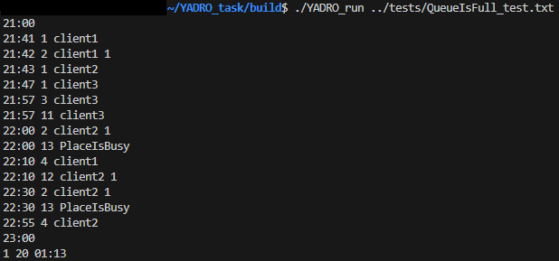
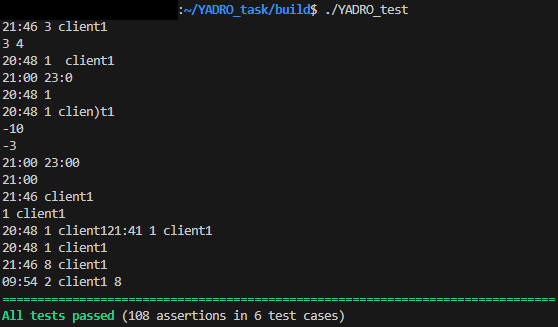

# Тестовое задание С++ YADRO

Задание выполнялось на ОС Linux (Ubuntu 22.04) с использованием CMake и Catch2

### Установка библиотеки для тестирования

```
$ sudo apt install catch2 -y
```

### Запуск

При сборке генерируется два исполняемых файла YADRO_run и YADRO_test

Пример запуска конкретного теста

```
$ ~/YADRO_task/build/$ ./YADRO_run ../tests/example_test.txt
```
Результат выводится в консоль



В данной реализации используются две директории test и answers в которых находятся текстовые файлы с входными данными и результирующим выводом соответственно.

Пример запуска тестирования

```
$ ~/YADRO_task/build/$ ./YADRO_test
```
